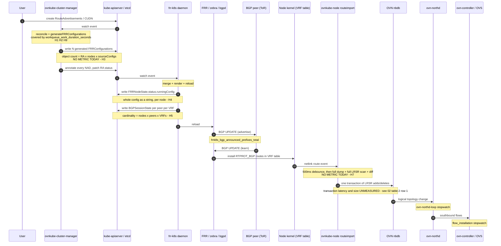

# 03 — Bottleneck Analysis

Twelve ranked hypotheses about where BGP and EVPN will fail first, each with its mechanism,
the metric that confirms or refutes it, a candidate fix, and which project owns it.

## Contents

1. [How to read this document](#how-to-read-this-document)
2. [The end-to-end path](#the-end-to-end-path)
3. [Ranked hypotheses](#ranked-hypotheses)
4. [Ownership summary](#ownership-summary)
5. [Blind spots](#blind-spots)

---

## How to read this document

These started as **falsifiable hypotheses** derived from reading the code, stated before the
benchmark so the benchmark could not be tuned to confirm them. As of 2026-10-09 the
`bgp-ra-density` lane has run twice, so some now carry measured verdicts; entries without one
remain untested rather than refuted. See [08 — First CI Results](08-first-ci-results.md) for
the scoreboard. Each entry has:

- **Mechanism** — what the code actually does, with file and symbol
- **Why it scales badly** — the shape of the growth
- **Confirm with** — the specific metric or observation that settles it
- **Candidate fix** — what a fix would look like, not a commitment to build it
- **Owner** — ovn-kubernetes, frr-k8s, FRR, or OVN

Ranking is by expected time-to-failure at the target scale, not by severity of fix.

---

## The end-to-end path

Every hypothesis sits on one hop of this path. The annotations mark which metric covers each
hop and where nothing does.

Two hops carry no instrumentation at all: **generated-object write volume** and **libovsdb
transaction cost**. Those are the first two rows of
[02 table 2](02-metrics.md#table-2-missing-with-code-sites).

---

## Ranked hypotheses

### 1. `ReconcileAll()` fan-out

**Priority**: Critical. **Owner**: ovn-kubernetes. **Status: CONFIRMED** at six nodes and 20
RouteAdvertisements — the `clustermanager-node-node` queue peaked at 19.85 adds/s while the RA
queue itself took 0.22/s, and the RA queue reached a depth of 15 of 20.

**Mechanism.** `pkg/clustermanager/routeadvertisements/controller.go` runs seven
sub-controllers. Four of them respond to *any* qualifying event by re-enqueueing **every**
RouteAdvertisements object rather than the affected ones:

| Watch | Handler | Line |
|---|---|---|
| Node | `func(_ string) error { c.raController.ReconcileAll(); return nil }` | 220 |
| UplinkState | same | 231 |
| FRRConfiguration | `reconcileFRRConfiguration` → `ReconcileAll()` | 1962 |
| NAD | `reconcileNAD` → `ReconcileAll()` | 1989 |

`nodeNeedsUpdate` (L1910) admits changes to labels, host subnets, tunnel ID,
`node-primary-ifaddr`, DPU host address, L3 gateway config, chassis ID and the VTEP
annotation. Several of those change for reasons entirely unrelated to BGP.

Every RA sub-controller is constructed with `Threadiness: 1`, so the resulting work is
serialised on a single goroutine.

**Why it scales badly.** Cost becomes `O(RAs)` per unrelated cluster event, not `O(1)`. At
1000 RAs, a single node relabel schedules 1000 full reconciles, each of which is itself
`O(nodes x ...)` (see hypothesis 2). Steady-state control-plane CPU becomes a function of
background churn rather than of BGP intent.

A partial precedent for the fix already exists in the same file: the `raNetworks` cache
(`setRANetworks` / `getRAsForNetwork`, L118-146) is used by the network-ref reconciler at
L279 to requeue only the RAs that select the changed network. The node and FRRConfiguration
paths do not use an equivalent.

**Confirm with.** `rate(ovnkube_clustermanager_workqueue_adds_total{name="clustermanager
routeadvertisements controller"}[2m])` on an otherwise idle cluster carrying background pod
churn. If it is non-zero and scales with RA count, confirmed. The
[incremental protocol's](01-methodology.md#incremental) "relabel one node" case isolates it
cleanly: semantically a no-op, so any cost at all is amplification.

**Candidate fix.** Index RAs by the node attributes and source-config names they actually
depend on and requeue only matches, extending the `raNetworks` pattern. Separately, raise
threadiness. The index is the real fix; threadiness only buys headroom.

---

### 2. `generateFRRConfigurations` recomputes everything

**Priority**: ~~Critical~~ **Medium**. **Owner**: ovn-kubernetes.

!!! note "Qualified on measured evidence, 2026-10-09"

    The recompute is real but it is **not** where the second goes. Twenty reconciles at a 1.02 s
    work p99 is roughly 20 s of handler time, against under 2 core-seconds of cluster-manager
    CPU for the whole run, and the CPU profiles contain no ovn-kubernetes frames at all. At
    least 90% of each reconcile is blocked on the apiserver, not computing. The cross-reconcile
    caching this entry proposes therefore buys little on its own; the per-reconcile **write
    count** is what matters, which is hypothesis 3's axis. Re-test on the wide lane, where the
    per-node loops grow.

**Mechanism.** `generateFRRConfigurations` (L488-925) plus `generateFRRConfiguration` (L966)
rebuild the complete desired state on every reconcile. Specific costs inside one call:

| Cost | Line |
|---|---|
| `c.nodeLister.List(selector)` — a **full node list per selected source FRRConfiguration** | 667 |
| Parse the VTEP annotation of **every** selected node | 727 |
| Outer loop over all nodes, inner over the node's networks, inner over source configs | 841-922 |
| `c.nodeLister.Get(nodeName)` plus `GetNodeIfAddrAnnotation` parse **inside the per-router loop** | 1042 |
| `allNoOverlayPodSubnets` recomputed **inside the per-router loop** over all selected networks | 1021-1030 |
| A fresh prefix slice allocated per neighbour | in `generateFRRConfiguration` |
| Cross-VRF leaking appends an extra `Router` per other selected VRF, so `O(VRFs)` extra routers per source router | 1182-1202 |
| Sorting for determinism, `O(n log n)`, on every reconcile | 512, 607-614, 640, 662 |

The `hostSubnets` and `eipsByNodesByNetworks` helpers are memoised **within one reconcile
only**, and the code says so: `// TODO perhaps cache across reconciles as well` at L765 and
L786.

**Why it scales badly.** Roughly `O(nodes x sourceConfigs x routers x neighbors x prefixes)`
per reconcile, with allocation proportional to the same product. Combined with hypothesis 1,
the total is that product multiplied by RA count multiplied by unrelated event rate.

**Confirm with.** `ovnkube_clustermanager_workqueue_work_duration_seconds` for the RA
controller across the node and CUDN ladders; a CPU profile from the existing `pprof`
measurement should show the node-lister and annotation-parsing paths dominating.

**Candidate fix.** Lift the caches to controller scope with informer-driven invalidation —
the TODO already names it. Hoist `nodeLister.Get` and `allNoOverlayPodSubnets` out of the
per-router loop. Both are local changes with no API impact.

---

### 3. Generated `FRRConfiguration` object explosion

**Priority**: Critical. **Owner**: ovn-kubernetes, with the cost landing on apiserver/etcd.

**Mechanism.** One generated object per (RA x node x matching source FRRConfiguration),
labelled `k8s.ovn.org/route-advertisements: <ra>` and annotated `<ra>/<sourceConfig>/<node>`.
`updateFRRConfigurations` (L1521) lists the existing set, indexes it by that annotation key,
and creates, updates or deletes as needed, using `reflect.DeepEqual` on the whole spec
(L1575) to decide whether an update is required.

Because `PodNetwork` advertisement **requires a nodeSelector matching every node**, the node
dimension cannot be reduced by selection. Only `EnableDynamicUDNAllocation` and the
`NodeHasNetwork` skip at L851 reduce it, and only for networks genuinely inactive on a node.

**Why it scales badly.** See the [derived quantities](01-methodology.md#generated-frrconfiguration-objects):
up to 500,000 objects at 1000 CUDNs x 500 nodes without dynamic allocation, 50,000 with it.
Each object carries a copy of the prefix list per neighbour, so peer count multiplies stored
bytes. `DeepEqual` over the whole spec deep-compares those slices on every reconcile of every
object; in the mesh model each spec holds `2(N-1)` neighbours.

**Confirm with.** `apiserver_storage_objects{resource="frrconfigurations.frrk8s.metallb.io"}`,
the proposed `..._frr_configurations{ra}` gauge and `..._frr_configuration_writes_total{op}`
counter ([02 table 2 row 3](02-metrics.md#table-2-missing-with-code-sites)) — specifically
the ratio of `unchanged` to `update`, which measures wasted comparison work — and etcd
database size.

**Candidate fix.** Compare a cheap hash before falling back to `DeepEqual`. Longer term,
consider whether one object per node per RA can carry multiple source-config derivations, or
whether frr-k8s could accept a node-list rather than requiring one object per node.

---

### 4. `FRRNodeState.status.runningConfig` size

**Priority**: ~~Critical~~ **Medium**, and a **ceiling rather than a slope**. **Owner**: frr-k8s.

!!! note "Demoted on measured evidence, 2026-10-09"

    The first two CI runs measured 2,306 B per node for 20 advertised Layer3 CUDNs across six
    nodes: 650x headroom to the 1.5 MB limit. frr-k8s **merges** the per-node generated
    configurations before rendering, so 133,728 bytes of generated FRRConfiguration collapsed
    into 13,841 bytes of running config, a **9.7x compaction**. The 20 configs share a
    neighbour and differ only in prefixes, which is the shape that compacts best. This is no
    longer a candidate for "fails first". See [08 — First CI Results](08-first-ci-results.md).

**Mechanism.** frr-k8s writes one `FRRNodeState` per node whose `status.runningConfig` holds
the **entire rendered FRR running configuration as a single string**, alongside
`lastConversionResult` and `lastReloadResult`. It is rewritten whenever the config changes.

**Why it scales badly.** The rendered config grows with VRF count, neighbour count, per-VRF
route-target stanzas and the EVPN raw-config block that ovn-kubernetes appends
(`rawconfig.go` emits `address-family l2vpn evpn`, `advertise-all-vni`, per-MAC-VRF `vni`
blocks, per-IP-VRF `vrf`/`vni` mappings and a `router bgp <asn> vrf <name>` section per VRF).
With 1000 VRFs this is plausibly megabytes. The **default etcd object size limit is 1.5 MB**;
past it, writes fail outright and the node's state stops updating.

**Confirm with.** [02 table 3](02-metrics.md#table-3-measured-outside-prometheus) — measure
`length(status.runningConfig)` across the VRF ladder at 10/100/400/1000 and extrapolate.
Report the VRF count at which writes fail and the exact apiserver error. **The axis that
matters is distinct prefixes and VRFs, not generated object count**, since the measured
compaction shows object count is almost free. EVPN is still the case to watch: `rawconfig.go`
emits per-VRF stanzas that do not merge the way a shared neighbour does.

**Candidate fix.** Upstream frr-k8s: store a hash plus a truncated or opt-in config body, or
move the full config to a ConfigMap referenced by the status. This is a cross-project
conversation to open early because it has a long lead time — see
[roadmap P5](05-roadmap.md).

---

### 5. `BGPSessionState` cardinality

**Priority**: High, ceiling. **Owner**: frr-k8s.

**Mechanism.** frr-k8s publishes one `BGPSessionState` per (node, peer, VRF), each carrying
`bgpStatus`, `bfdStatus`, `node`, `peer` and `vrf`.

**Why it scales badly.** Multiplicative: 500 nodes x 2 peers x 1000 VRFs is 1,000,000 objects.
The mesh model reaches 499,000 with no VRFs at all. Beyond storage, these objects are written
on every session state change, so a fabric flap produces a write storm proportional to the
same product.

**Observed, unexplained.** Both CI runs reported 12 objects for six nodes with only six
`Established`, while the peer reported `peerCount: 6, failedPeers: 0`. A three-node lab with
21 RouteAdvertisements shows one object per node, all established, from a source configuration
with a single neighbour. The `receive-all` template supports a **second router block**
(`SsFrr*` neighbours), so the leading explanation is a second configured neighbour that never
comes up, i.e. a harness artifact rather than evidence for this hypothesis. A daemon rollout
was ruled out as a cause: GC replaces the objects cleanly. The run hook now records the
breakdown by status, peer and VRF plus the neighbours each source configuration asks for, so
the next run settles it.

**Confirm with.** Object count via `apiserver_storage_objects`, write rate via
`apiserver_request_total{resource="bgpsessionstates",verb="update"}`, and apiserver p99
latency during an induced ToR flap.

**Candidate fix.** Upstream frr-k8s: aggregate per node rather than per session, or make
publication opt-in per VRF. From the ovn-kubernetes side the only lever is reducing VRF count,
which is a user-facing design choice, not a fix.

---

### 6. frr-k8s metrics exporter scrape cost

**Priority**: High. **Owner**: frr-k8s.

**Mechanism.** The `frrk8s_bgp_*` metrics are produced by a collector that shells out to
`vtysh` and parses JSON output, rather than reading an in-process counter.

**Why it scales badly.** Scrape cost grows with peers x VRFs. At 1000 VRFs the `vtysh`
invocation itself may exceed the scrape interval, causing scrape timeouts, gaps in the
observability data, and — worse — CPU contention with bgpd on the same node during exactly
the convergence events you are trying to measure.

**Confirm with.** `scrape_duration_seconds{job=~".*frr.*"}` and `up{job=~".*frr.*"}` across
the VRF ladder. This is the rare case where the observability tooling is itself the subject
of the benchmark.

**Candidate fix.** Upstream: cache and rate-limit the collector, or have frr-k8s maintain
counters in-process. Locally: raise the scrape interval for that job and document that
BGP-session metrics have coarser resolution than everything else.

---

### 7. `routeimport` full dump and diff per network

**Priority**: High. **Owner**: ovn-kubernetes.

**Mechanism.** `pkg/ovn/routeimport/route_import.go` subscribes to netlink route and link
events with a 100-entry buffer and a 1 s resubscribe period, debounces for
`reconcileDelay = 500ms` (L40), then for each affected network runs `syncNetwork` (L326):

1. `getBGPRoutes` (L434) lists **all** `RTPROT_BGP` routes in the network's VRF table
2. `getOVNRoutes` (L507) predicate-scans **all** LRSRs owned by `RouteImport` on the node's
   gateway router
3. set-diffs the two
4. applies all adds and deletes in **one** libovsdb transaction

Steps 1 and 4 are already well engineered: routes are streamed with `RouteListFilteredIter`
rather than materialised, and the batching into a single transaction is deliberate, with a
comment explaining that per-route cache lookups would deep-copy the router.

**Why it scales badly.** The scan is `O(routes + LRSRs)` **per network per 500 ms window**.
At 1000 networks and 100,000 routes that is a repeated full-table walk. The pathological case
is the ToR flap: a full withdrawal followed by a full re-announce produces the largest single
transaction the system will ever construct, and `--db-txn-timeout` (default 100 s) is the only
thing bounding it.

**Confirm with.** The proposed `route_import_sync_duration_seconds{network}` and
`..._ops_total{network,op}` ([02 table 2 row 6](02-metrics.md#table-2-missing-with-code-sites));
the existing `BenchmarkBGPRoutesStreaming` in `route_import_test.go` for the scan half without
needing a cluster; and `ovn_db_txn_try_again` rate during the flap scenario.

**Candidate fix.** Apply the netlink event deltas incrementally instead of re-diffing the full
table, keeping the full sync as a periodic correctness backstop. Chunk very large transactions.

---

### 8. EVPN scales with pods, not nodes

**Priority**: High. **Owner**: ovn-kubernetes and FRR.

**Mechanism.** `pkg/node/controllers/evpn/evpn_pod_controller.go` programs, per pod IP, one
permanent neighbour entry on the L2 SVI and one static FDB entry for the pod MAC
(`ensurePodNeighbors`, L184). zebra then originates an EVPN **Type-2 (MAC/IP)** route from
each. The controller runs with `Threadiness: 1`. At boot, `cleanStalePodEntries` (L262) lists
all pods in every namespace served by every EVPN network, unmarshals each pod's OVN
annotation, and dumps the FDB and neighbour tables per SVI.

**Why it matters.** This is the single most important scale difference between the two
features and it should be stated in exactly these terms:

> Plain route advertisements produce prefixes proportional to **nodes x networks**.
> EVPN produces Type-2 routes proportional to **pods**.

At 100,000 pods the fabric carries 100,000 Type-2 routes plus Type-3 per VNI per VTEP. That is
a fabric-sizing constraint, not just an ovn-kubernetes one, and it must be communicated to
whoever owns the ToRs.

`cleanStalePodEntries` additionally makes node-agent restart cost `O(pods)` per node.

**Confirm with.** The proposed `evpn_pod_program_duration_seconds`, `evpn_fdb_entries` and
`evpn_neigh_entries` ([02 table 2 row 7](02-metrics.md#table-2-missing-with-code-sites));
Type-2 route count at the peer via `vtysh`; node-agent restart time under the
[cold start protocol](01-methodology.md#cold-start).

**Candidate fix.** Batch netlink writes, raise threadiness, and make the boot scan
incremental. Route aggregation at the fabric level is a deployment answer, not a code one.

---

### 8b. EVPN hard ceilings

**Priority**: High, and these are **walls, not curves**. **Owner**: SVD design and the EVPN
implementation.

| Ceiling | Value | Mechanism | Mitigation |
|---|---|---|---|
| MAC-VRF + IP-VRF per VTEP | **4094** | Single VXLAN Device mode distinguishes VNIs by VLAN ID on one netdev | Multiple VTEPs. 1000 CUDNs with both VRF types is 2000 VLANs, about half the limit, so the ladder must cross it deliberately |
| VTEP status per-node IP map | flagged as non-scaling at ~5000 nodes in `docs/okeps/okep-5088-evpn.md:1001` | Status holds a per-node map | Restructure status; measure the curve at 500 to see where it starts |
| VXLAN port | fixed at 4789 | Not configurable | None needed; noted for completeness |
| CUDN name length | under 16 characters | VRF name predictability | Affects workload template naming |

`test/e2e/allocators/bgp.go` already encodes `vidMin = 2`, `vidMax = 4094`, so a scale test
that deliberately exhausts VLANs will collide with the e2e allocator and needs its own
allocation scheme.

**Confirm with.** The proposed `evpn_vlans_used{vtep}` gauge, and a deliberate over-subscription
run to observe the failure mode. A clean, early error is an acceptable outcome; a partial
silent failure is a bug.

---

### 9. EgressIP resolution is `O(EIPs x namespaces)`

**Priority**: Medium. **Owner**: ovn-kubernetes.

**Mechanism.** `getEgressIPsByNodesByNetworks` (L1802) lists all EgressIPs and, for each,
resolves its namespace selector via `namespaceLister.List` and then
`GetActiveNetworkForNamespaceFast` per matched namespace. `reconcileEgressIPs` (L2025) is
wired to both the EgressIP and Namespace informers, so any EgressIP status change or
namespace **label** change re-enqueues every EgressIP-advertising RA.

**Why it scales badly.** Quadratic in the two dimensions that grow together in a large
multi-tenant cluster, and triggered by namespace label churn that has nothing to do with
egress.

**Confirm with.** The proposed `egressip_resolve_duration_seconds` histogram; the
`PodNetwork` vs `PodNetwork + EgressIP` variant in the
[workload matrix](01-methodology.md#workload-matrix) isolates it directly.

**Candidate fix.** Maintain a namespace-to-EgressIP index updated incrementally from the
informers.

---

### 10. Advertised-network isolation is `O(subnets^2)`

**Priority**: Medium. **Owner**: ovn-kubernetes.

**Mechanism.** `pkg/ovn/udn_isolation.go`, `addAdvertisedNetworkIsolation` (L482), builds a
match expression of the shape `src in {subnets} && dst in {subnets}` and issues one
transaction per (network, node). The global drop ACL's address set grows with every advertised
network's subnets. `ConfigureAdvertisedNetworkIsolation` (L311) sets up the shared port group
and address set. The whole path is gated on
`config.OVNKubernetesFeature.AdvertisedUDNIsolationMode == strict`.

**Why it scales badly.** The match string grows quadratically with advertised subnet count, and
OVN must compile it into logical flows on every node. `--advertised-udn-isolation-mode=loose`
skips the path entirely, which is why strict-versus-loose is a
[first-class benchmark axis](01-methodology.md#scale-ladder) rather than a footnote.

**Confirm with.** The proposed `advertised_network_isolation_duration_seconds`;
`ovn_northd_ovn_northd_loop_*` and `ovn_controller_integration_bridge_openflow_total` compared
between the two modes; nbdb size delta.

**Candidate fix.** Express isolation with address-set references rather than an inline
quadratic match, if OVN's matching semantics allow it.

---

### 11. Periodic full resyncs on the node

**Priority**: Medium. **Owner**: ovn-kubernetes.

**Mechanism.** Several node-side components perform unconditional full syncs on a timer:

| Component | Behaviour |
|---|---|
| `pkg/node/vrfmanager/vrf_manager.go` | `reconcile()` (L164) re-syncs every managed VRF plus `repair()` on each ticker tick and after each link-event quiet period; `repair` lists all links |
| `pkg/node/netlinkdevicemanager/controller.go` | 60 s full sync with 5 s jitter, 100-entry event channel |
| `pkg/node/controllers/evpn/evpn_node_controller.go` | `collectEVPNNetworks` (L492) walks **all** networks under the network-manager lock on every VTEP reconcile, explicitly rebuilt each time; `reconcileOVSPorts` (L585) does a full OVS port scan per reconcile; `reconcileNAD` requeues the whole VTEP on any NAD change |

**Why it scales badly.** Cost is `O(state)` at a fixed frequency regardless of whether anything
changed, so idle CPU per node grows with network count across 500 nodes simultaneously.

**Confirm with.** Per-node CPU with an idle cluster at each rung of the CUDN ladder — the
[steady-state CPU SLI](01-methodology.md#service-level-indicators). Node-side CPU that grows
with network count while nothing is changing confirms it.

**Candidate fix.** Event-driven reconciliation with periodic full sync as a slow backstop, and
caching `collectEVPNNetworks` behind a network-manager generation counter.

---

### 12. Hardcoded concurrency and rate limiting

**Priority**: ~~Medium~~ **Critical, and now the best-evidenced single change**.
**Owner**: ovn-kubernetes. **Status: CONFIRMED.**

!!! success "Promoted on measured evidence, 2026-10-09"

    Measured twice, within 0.02 s of each other: RouteAdvertisements queue wait p99 **16.08 s**
    against a work p99 of **1.02 s**, a 15.8x ratio, while every other queue in the process has
    wait approximately equal to work. apiserver `APIInflightRequests` never exceeded 2 mutating,
    which is the single-worker signature seen from the server side. Because the blocked time is
    I/O rather than CPU (see hypothesis 2), added workers should convert almost directly into
    throughput until inflight becomes the limit — and inflight is currently at 2.

**Mechanism.** The shared controller framework
(`pkg/controller/controller.go`) supports `Threadiness`, `RateLimiter` and `MaxAttempts`, but:

- `Threadiness: 1` is passed at 30+ call sites, including every RouteAdvertisements,
  managedbgp, VTEP and EVPN sub-controller. No config flag wires it.
- The RA sub-controllers pass `workqueue.DefaultTypedControllerRateLimiter` rather than the
  framework's `DefaultRateLimiter`, adding a 10 qps / 100 burst token bucket on top of
  exponential backoff.
- `DefaultMaxAttempts = 15`.
- There is no config knob for client-go QPS/burst, informer resync period, or OVSDB
  transaction batch size.
- `--db-txn-timeout` (default 100 s) is the one documented high-scale dial; its config comment
  says it "may be useful to increase for high-scale clusters".

**Why it matters.** Once hypotheses 1 and 2 are confirmed, the queue metrics will show
starvation and there will be no way to respond without a code change. Exposing threadiness is
a small PR that converts a code change into a tuning experiment, and it lets the benchmark
separate "the algorithm is expensive" from "we only run one worker".

**Confirm with.** `workqueue_queue_duration_seconds` high while `work_duration_seconds` is
moderate indicates starvation rather than expensive work. Re-run with a patched threadiness to
quantify the headroom.

**Candidate fix.** Add a `--controller-threadiness` style knob (or per-controller config) and
document safe values. Note that raising threadiness on a controller whose reconciles touch
shared state requires checking for races first — this is not unconditionally safe.

---

## Ownership summary

Answers goal 3 — how the pain distributes across the integration.

| Hypothesis | ovn-kubernetes | frr-k8s | FRR / zebra | OVN / OVS |
|---|---|---|---|---|
| 1 `ReconcileAll()` fan-out | Yes | | | |
| 2 `generateFRRConfigurations` | Yes | | | |
| 3 Object explosion | Yes (producer) | Yes (schema forces per-node objects) | | |
| 4 `FRRNodeState` size | | Yes | | |
| 5 `BGPSessionState` cardinality | | Yes | | |
| 6 Exporter scrape cost | | Yes | Yes (`vtysh` cost) | |
| 7 `routeimport` full diff | Yes | | | Yes (transaction size) |
| 8 EVPN per-pod | Yes (programming) | | Yes (Type-2 volume) | |
| 8b EVPN ceilings | Yes (allocation) | | Yes (SVD) | |
| 9 EgressIP resolution | Yes | | | |
| 10 Isolation `O(subnets^2)` | Yes | | | Yes (flow compilation) |
| 11 Node full resyncs | Yes | | | Yes (OVS scans) |
| 12 Hardcoded concurrency | Yes | | | |

Five of twelve involve frr-k8s or FRR. Two are wholly owned upstream. That ratio is the reason
[roadmap P5](05-roadmap.md) opens the upstream conversation early rather than at the end.

---

## Blind spots

Hops on the [end-to-end path](#the-end-to-end-path) with no metric, in the order they should be
closed:

1. **libovsdb transaction latency and size.** `pkg/libovsdb/ops/transact.go` has no
   instrumentation. Affects hypotheses 7 and 10 directly and every other feature indirectly.
2. **Generated-object write volume.** No count, no create/update/delete breakdown, no
   unchanged-comparison ratio.
3. **Node-side workqueues.** ovnkube-node never registers the workqueue metrics provider, so
   `routeimport` and the EVPN controllers have no queue visibility at all.
4. **FRR reload wall time.** Available only as a string in `FRRNodeState.status`, not as a
   metric.
5. **The convergence SLI itself.** Nothing in-cluster observes the peer's route table. This is
   what the custom kube-burner measurement in
   [04](04-ci-kube-burner.md#upstream-asks) is for.
