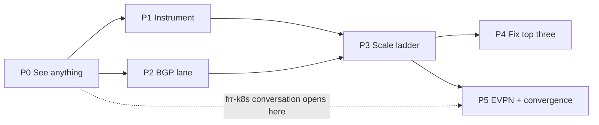

# 05 — Roadmap

Six phases, sized for sprints, in strict dependency order: **observe before benchmark, benchmark
before optimise.**

## Contents

1. [Dependency order](#dependency-order)
2. [Phase P0 — See anything](#phase-p0-see-anything)
3. [Phase P1 — Instrument the blind spots](#phase-p1-instrument-the-blind-spots)
4. [Phase P2 — Minimum viable BGP lane](#phase-p2-minimum-viable-bgp-lane)
5. [Phase P3 — Scale ladder execution](#phase-p3-scale-ladder-execution)
6. [Phase P4 — Fix the top three](#phase-p4-fix-the-top-three)
7. [Phase P5 — EVPN and convergence](#phase-p5-evpn-and-convergence)
8. [Cross-project dependencies](#cross-project-dependencies)
9. [Risk assessment](#risk-assessment)
10. [Success criteria](#success-criteria)

---

## Dependency order

P1 and P2 are parallelisable across two engineers. P4 is **gated on P3 evidence** — no
optimisation lands before the measurement that justifies it, or the team spends a sprint making
something faster that was never the limiter.

The frr-k8s upstream conversation ([hypotheses 4 and 5](03-bottlenecks.md#4-frrnodestatestatusrunningconfig-size))
is drawn from P0 deliberately: it has the longest lead time of anything here and should not wait
for P5 to start.

---

## Phase P0 — See anything

**Goal**: Make ovn-kubernetes, OVN, OVS and frr-k8s metrics visible in the existing performance
lane. Nothing else in this roadmap can start without it.

**Duration**: 1 sprint.

### Activity 0.1: Prometheus scrape configuration

`contrib/prometheus-values.yaml` has no ServiceMonitor and `KIND_PROMETHEUS_INFRA_ONLY: "true"`.
Add ServiceMonitor or PodMonitor definitions for ovnkube-node (`:9410`), ovnkube-control-plane
(`:9411`), the OVN DB and northd exporters, and the frr-k8s metrics service.

**Deliverable**: `kubectl get --raw /api/v1/namespaces/monitoring/...` shows ovnkube targets up,
and `ovnkube_clustermanager_workqueue_depth` returns data in the lane's Prometheus.

### Activity 0.2: Enable the metrics flags

`--metrics-enable-scale-metrics` and `--metrics-enable-config-duration` in the perf lane's
ovnkube deployment. See [02 required flags](02-metrics.md#required-flags).

**Deliverable**: The full workqueue metric family present for all controllers.

### Activity 0.3: `contrib/perf/metrics-ovnk.yml`

The PromQL profile from [02](02-metrics.md#useful-promql), added as a second entry in
`metric-endpoint.yml` and `metric-endpoint-local.yml` rather than merged into `metrics.yml`, so
existing baselines stay comparable.

**Deliverable**: A nightly run producing ovnkube metric series in the indexed output.

### Activity 0.4: Register node-side workqueue metrics

ovnkube-node never calls `registerWorkqueueMetrics`, so `routeimport` and the EVPN controllers
have no queue visibility. Small fix, gated on the same flag.

**Deliverable**: `ovnkube_node_workqueue_*` present.

### Activity 0.5: Documentation chore

Unrelated to the narrative, found during research, one small PR. Version skew matters here
because the FRR version determines EVPN behaviour under test.

| Fix | Detail |
|---|---|
| FRR version skew | `test/README.md` says `FRR_IMAGE` defaults to `10.5.3`; `contrib/kind-common.sh` pins `FRR_DEPLOYED_IMAGE=quay.io/frrouting/frr:10.6.0` |
| EVPN FRR requirement | `evpn.md` Prerequisites say "FRR 10+", its Known Limitations say "FRR 9+ for SVD" |
| `contrib/kind.sh` | `test/README.md` and `test/UPDATE.md` both claim it does not exist; it is a symlink to `kind-helm.sh` |
| mkdocs nav | `okep-6224-dhcp-ipam-localnet.md` is missing from the nav |

**Deliverable**: One PR closing all four.

### Activity 0.6: Open the frr-k8s conversation

File upstream issues for [hypothesis 4](03-bottlenecks.md#4-frrnodestatestatusrunningconfig-size)
(`FRRNodeState.status.runningConfig` versus the etcd object limit) and
[hypothesis 5](03-bottlenecks.md#5-bgpsessionstate-cardinality) (`BGPSessionState` cardinality),
stating the derived numbers from [01](01-methodology.md#derived-quantities) and committing to
supply measurements in P3.

**Deliverable**: Two upstream issues with the derivation and a named owner on our side.

**Exit criteria**: A nightly perf run whose artifacts contain ovnkube workqueue, OVN DB and
frr-k8s metrics. Two upstream issues open.

---

## Phase P1 — Instrument the blind spots

**Goal**: Add the metrics in [02 table 2](02-metrics.md#table-2-missing-with-code-sites) so that
a slow run can be attributed to a specific hypothesis rather than merely observed.

**Duration**: 2 sprints. Each row is an independent PR; they can be split across the team.

### Activity 1.1: libovsdb transaction metrics

`ovnkube_libovsdb_txn_duration_seconds{db,result}` and `ovnkube_libovsdb_txn_ops` in
`go-controller/pkg/libovsdb/ops/transact.go`, which has **zero instrumentation** today.

**Do this first.** It is the highest-leverage single PR in the whole document set: it is the
shared cost centre for every ovn-kubernetes feature, not just BGP, so it unblocks other teams'
perf work at the same time.

**Deliverable**: Transaction latency and op-count visible per database.

### Activity 1.2: RouteAdvertisements controller metrics

Rows 2-5 of table 2: reconcile duration, generated-object count and write breakdown,
advertised prefix count, NAD list size. All in
`pkg/clustermanager/routeadvertisements/controller.go`; the reconcile timing already exists as a
`klog.V(4)` line and only needs promoting to a histogram.

**Deliverable**: Hypotheses 1, 2 and 3 become directly measurable.

### Activity 1.3: Node-side metrics

Row 6 (`routeimport` sync duration, route counts, op counts) and rows 7-9 (EVPN pod programming,
FDB and neighbour counts, VTEP reconcile, VLANs used).

**Deliverable**: Hypotheses 7, 8 and 8b become measurable, including a dashboard warning as the
4094 VLAN ceiling approaches.

### Activity 1.4: Histogram buckets

Widen `prometheus.ExponentialBuckets(10e-3, 10, 6)` at `pkg/metrics/workqueue.go:57,63`. Six
buckets spanning 10 ms to 1000 s makes p99 estimates useless.

**Deliverable**: Usable percentiles.

### Activity 1.5: Go benchmarks in CI

`BenchmarkBGPRoutesStreaming` already exists in `pkg/ovn/routeimport/route_import_test.go` and
nothing runs it. Add a `go test -bench` job for the `routeimport` and `libovsdb/ops` packages.

**Deliverable**: A cluster-free early-warning signal on the two hottest paths.

**Exit criteria**: Every hypothesis in [03](03-bottlenecks.md) except 4, 5 and 6 has a named
metric that can confirm or refute it. (Those three are frr-k8s-side and are measured
out-of-band.)

---

## Phase P2 — Minimum viable BGP lane

**Goal**: A nightly CI run that creates advertised networks at density and produces a
PR-comparable report.

**Duration**: 1-2 sprints. Parallel with P1.

### Activity 2.1: Templates

`contrib/perf/workloads/templates/bgp/` — RA, advertised CUDN (L2 and L3), base
FRRConfiguration. Reuse the existing `udn-density` deployment, service and netpol templates
unchanged. Mirror `test/e2e/allocators/bgp.go` for subnet and VNI arithmetic.

Watch the two constraints: CUDN names under 16 characters, and `nodeSelector: {}` mandatory for
`PodNetwork`.

**Deliverable**: Templates that render to valid YAML with dummy vars.

### Activity 2.2: `bgp-ra-density.yml` and `bgp-ra-churn.yml`

Using `waitOptions.customStatusPaths` for RA `Accepted`, the existing `pprof` block verbatim, and
`churnConfig` for the churn variant.

**Deliverable**: `kube-burner init --config` parses; a local kind run completes.

### Activity 2.3: Out-of-band hooks

A `beforeCleanup` hook script capturing the [02 table 3](02-metrics.md#table-3-measured-outside-prometheus)
quantities: `FRRNodeState` sizes, generated-object counts, `BGPSessionState` counts, peer route
table via `vtysh`.

This also produces the **coarse first convergence number** without writing any Go — see
[04](04-ci-kube-burner.md#1-a-bgp-convergence-measurement).

**Deliverable**: A shell script in `contrib/perf/` writing JSON into the artifact directory.

### Activity 2.4: Alert profile and matrix entries

`contrib/perf/alerts-bgp.yml` starting at `severity: warning`, and two new nightly-only matrix
entries in `performance-test.yml` using the already-plumbed `ENABLE_ROUTE_ADVERTISEMENTS` and
`ADVERTISED_UDN_ISOLATION_MODE` env vars.

**Deliverable**: A nightly `bgp-ra-density` run appearing in the PR comment tooling.

**Exit criteria**: Two consecutive green nightly runs producing a report that
`compare-reports.py` can diff against a baseline. **This is where the P2 skeletons stop being
unvalidated** — [04](04-ci-kube-burner.md#workload-skeletons) marks them as such until this
criterion is met.

---

## Phase P3 — Scale ladder execution

**Goal**: Actual numbers. Climb the [scale ladder](01-methodology.md#scale-ladder), publish the
derived-quantity table with measured values beside predicted ones, and confirm or kill each
hypothesis.

**Duration**: 2-3 sprints, dominated by cluster availability rather than engineering.

### Activity 3.1: Evaluate kwok

Before booking hardware, test whether kwok-emulated nodes exercise the cluster-manager half.
Hypotheses 1-5 are all pure Kubernetes-object workloads and should be reachable at 500 emulated
nodes on one machine. See [the kind ceiling](04-ci-kube-burner.md#kwok-as-a-middle-tier).

**Deliverable**: A go/no-go on kwok with evidence, which determines how much real hardware P3
actually needs.

### Activity 3.2: Control-plane ladder

Nodes 24 → 60 → 120 → 250 → 500 and CUDNs 10 → 100 → 400 → 1000, under each
[topology model](01-methodology.md#topology-models), with the dynamic-UDN-allocation variant.

**The headline result**: the measured generated-`FRRConfiguration` count with and without
dynamic allocation, against the predicted 500,000 versus 50,000.

**Deliverable**: A results page with the measured-versus-predicted table.

### Activity 3.3: Node-side ladder

Pods per node 50 → 120 → 200 and imported routes 1k → 10k → 100k → 500k. Per-node load does not
require 500 real nodes, so this can run on a small cluster.

**Deliverable**: `routeimport` sync duration and EVPN programming curves.

### Activity 3.4: Ceilings

Deliberately cross the walls and record the failure mode, not just the rung:
`FRRNodeState` versus the 1.5 MB etcd limit across the VRF ladder; 4094 VLANs per VTEP;
`BGPSessionState` write rate against apiserver saturation; VTEP status size across the node
ladder.

**Deliverable**: A "known ceilings" page giving each limit as a number plus its mechanism plus
its failure mode, linked from [03](03-bottlenecks.md).

### Activity 3.5: Failure recovery

The five [failure-recovery scenarios](01-methodology.md#failure-recovery). The ToR flap is the
one most likely to find a real defect.

**Deliverable**: Recovery times and any defects filed.

### Activity 3.6: Feed the upstream issues

Attach the measured `FRRNodeState` sizes and `BGPSessionState` counts to the P0.6 issues.

**Exit criteria**: Every hypothesis in [03](03-bottlenecks.md) marked confirmed, refuted or
unreachable, with the measurement attached. A published known-ceilings page. The top three
bottlenecks by measured impact identified — **which may not be the three predicted here**, and
saying so plainly is part of the deliverable.

---

## Phase P4 — Fix the top three

**Goal**: Optimise what P3 showed to be the limiter.

**Duration**: 2-3 sprints. **Gated on P3.**

Expected, based on the hypotheses — but the ranking comes from P3's numbers, not from this list:

### Activity 4.1: Narrow `ReconcileAll()`

Index RAs by the node attributes and source-config names they depend on, extending the existing
`raNetworks` cache pattern at `controller.go:118-146`, and requeue only matches.

**Deliverable**: Node relabelling on an idle cluster costs approximately nothing.

### Activity 4.2: Cross-reconcile caching in `generateFRRConfigurations`

Lift the `hostSubnets` and `eipsByNodesByNetworks` caches to controller scope with informer-driven
invalidation — the code's own `// TODO perhaps cache across reconciles as well` at L765 and L786.
Hoist `nodeLister.Get` and `allNoOverlayPodSubnets` out of the per-router loop.

**Deliverable**: Reconcile duration p99 reduced by a measured factor.

### Activity 4.3: Threadiness knob

Expose controller threadiness as configuration. The cheapest experiment in the set: it converts
a code change into a tuning dial and separates "the algorithm is expensive" from "we run one
worker". Requires a race review on each controller before raising the default.

**Deliverable**: A documented flag with tested safe values.

### Activity 4.4: Incremental route import

Apply netlink deltas instead of re-diffing the full table every 500 ms, keeping the full sync as
a periodic backstop. Only if P3 confirms hypothesis 7.

**Deliverable**: `route_import_sync_duration_seconds` decoupled from total route count.

**Exit criteria**: Each fix demonstrates a measured improvement on the same ladder rung that
exposed the problem, with the before and after published. Regression alerts in
`alerts-bgp.yml` promoted from `warning` to `error` at the new baseline.

---

## Phase P5 — EVPN and convergence

**Goal**: Close the EVPN-specific and cross-project items.

**Duration**: 2-3 sprints.

### Activity 5.1: EVPN workloads in CI

`evpn-density.yml` and `evpn-pod-density.yml` as nightly matrix entries, requiring `ENABLE_EVPN`
added to the workflow env block.

**Deliverable**: Nightly EVPN density coverage.

### Activity 5.2: The convergence measurement

Build `bgpRouteLatency` out-of-tree as a `kube-burner-ovnk` wrapper, modelled on
`netpolLatency`. Only if the P2.3 hook-based coarse number proved insufficient — say so
explicitly rather than building it reflexively.

**Deliverable**: `route_advertised_latency` and `evpn_pod_reachable_latency` as reported
percentiles.

### Activity 5.3: Upstream kube-burner

File the generic `crLatency` request from
[04](04-ci-kube-burner.md#2-generic-cr-condition-latency-measurement) — the ask most likely to
be accepted because it is generic — and upstream `bgpRouteLatency` once it has stopped changing.

**Deliverable**: Upstream issues filed; wrapper tracking the v2.5.0 pin.

### Activity 5.4: Multi-peer fabric harness

Parameterise `deploy_frr_external_container()` for N containers. Only if the mesh model's
results differ materially from the single-peer fabric results — see
[the fabric-side harness gap](04-ci-kube-burner.md#the-fabric-side-harness-gap).

**Deliverable**: The peers-per-node ladder dimension reachable, or a documented decision not to.

### Activity 5.5: Close the frr-k8s items

Land or track the fixes from the P0.6 issues with P3's measurements attached.

**Deliverable**: A status entry in [03](03-bottlenecks.md) for hypotheses 4 and 5.

**Exit criteria**: EVPN covered by the same nightly lane as BGP. Convergence SLIs reported. Every
frr-k8s item either fixed upstream, accepted with a timeline, or documented as a permanent
constraint operators must design around.

---

## Cross-project dependencies

| Item | Project | Blocks | Lead time |
|---|---|---|---|
| `FRRNodeState.status.runningConfig` size | frr-k8s | The 1000-VRF target entirely | Long. Open in P0 |
| `BGPSessionState` cardinality | frr-k8s | 1000 VRFs x multiple peers | Long. Open in P0 |
| Metrics exporter scrape cost | frr-k8s | Observability at high VRF count | Medium. Workaround: raise the scrape interval |
| Generic `crLatency` measurement | kube-burner | Nothing — `customStatusPaths` covers the waiting case | Medium. Nice to have |
| `bgpRouteLatency` measurement | kube-burner | Nothing — built out-of-tree first | Short, under our control |
| Type-2 route volume at fabric scale | FRR / the fabric vendor | The EVPN pod-density target | Not a code dependency; a deployment constraint to communicate |
| 4094 VLANs per VTEP | SVD design | 2000+ VRF-pairs per VTEP | Permanent. Mitigation is multiple VTEPs |
| OVN transaction throughput | OVN | Hypotheses 7 and 10 | Only actionable after P1.1 gives us the numbers |

Two of the eight are hard external blockers on the stated 1000-CUDN target and both are frr-k8s.
That is the single most important scheduling fact in this document, and it is why P0 opens those
issues rather than P5.

---

## Risk assessment

| Risk | Impact | Likelihood | Mitigation |
|---|---|---|---|
| No 500-node lab available | P3 cannot produce absolute ceilings | High | kwok for the control-plane half (hypotheses 1-5); per-node load on a small cluster for the node half; publish what is reachable and label the rest as unmeasured |
| frr-k8s upstream unresponsive | The 1000-VRF target is unachievable and we cannot fix it | Medium | Open issues in P0 with derived numbers; be prepared to document a supported VRF ceiling instead of raising it |
| kind results mistaken for capability numbers | Published numbers are wrong | Medium | Every kind result labelled **relative**; the [reporting rules](01-methodology.md#reporting-rules) say so and reviewers should enforce it |
| P1 instrumentation PRs stall in review | P3 runs blind | Medium | Each row of table 2 is independent; start with libovsdb, which other teams also want |
| Hypotheses are wrong | P4 optimises the wrong thing | **By design** | P4 is gated on P3. Stating hypotheses before measuring is what makes being wrong cheap and visible |
| Perf lane runtime exceeds the 240-minute timeout | Nightly runs fail | Medium | BGP lanes are nightly-only and separate; tune `jobIterations` down before raising the timeout |
| Code pointers in these docs rot | The documents become misleading | High over time | Symbol names are the durable part; P0 adds a grep-based staleness check |

---

## Success criteria

| # | Criterion | Phase | Measurable as |
|---|---|---|---|
| 1 | ovnkube, OVN, OVS and frr-k8s metrics visible in the perf lane | P0 | Series present in nightly artifacts |
| 2 | Every bottleneck hypothesis has a metric that can settle it | P1 | Table 2 rows merged |
| 3 | A nightly BGP lane produces PR-comparable reports | P2 | Two consecutive green runs |
| 4 | Measured versus predicted derived quantities published | P3 | The results page exists |
| 5 | Known ceilings published as numbers with failure modes | P3 | The ceilings page exists |
| 6 | Each hypothesis marked confirmed, refuted or unreachable | P3 | [03](03-bottlenecks.md) annotated |
| 7 | The top three measured bottlenecks improved, with before and after | P4 | Published deltas on the same rung |
| 8 | Regression alerts gating CI at the post-fix baseline | P4 | `severity: error` in `alerts-bgp.yml` |
| 9 | EVPN in the same nightly lane as BGP | P5 | Matrix entries green |
| 10 | Convergence SLIs reported as percentiles | P5 | `route_advertised_latency` in reports |
| 11 | Every frr-k8s item fixed, scheduled, or documented as permanent | P5 | Issue status |
| 12 | `test/GAPS.md` Gap 15 updated to reflect actual coverage | P5 | The gap entry narrowed to what remains |

Criterion 6 is satisfied by a **refutation** as much as by a confirmation. A hypothesis in
[03](03-bottlenecks.md) that measurement kills should be struck through with the number that
killed it, not quietly deleted — the next person to read the code will form the same hypothesis,
and the record of why it is wrong is worth more than a clean document.
